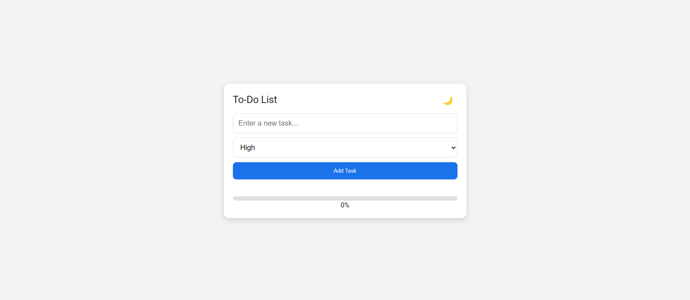

# To-Do List

A user-friendly and interactive To-Do List app built with **HTML, CSS, and JavaScript**. This app lets users add, edit, and delete tasks, track their progress, and switch between light and dark themes for an enhanced user experience.

## 🖼️ Preview

## 🚀 Features
- **Task Management** – Add, edit, and delete tasks easily.
- **Priority Levels** – Set task priority to high, medium, or low.
- **Progress Tracker** – View task completion progress with a real-time progress bar.
- **Dark Mode** – Toggle between light and dark themes for better visibility.
- **Responsive Layout** – Fully responsive design for desktop and mobile use.

## 📜 Instructions
- **Add Tasks**: Enter a task in the input field and choose its priority (High, Medium, Low).
- **Edit Tasks**: Click on the pencil icon next to a task to edit it.
- **Mark as Complete**: Click on the check mark to mark a task as completed.
- **Delete Tasks**: Click on the trash can icon to delete a task.
- **Track Progress**: The progress bar will update as tasks are completed.
- **Theme Toggle**: Switch between light and dark modes using the 🌙/☀ button.

## 💻 Technologies Used
- **HTML**: Markup structure for the app.
- **CSS**: Styling for the responsive layout and theme.
- **JavaScript**: Task management, theme toggle, and progress tracking functionalities.

